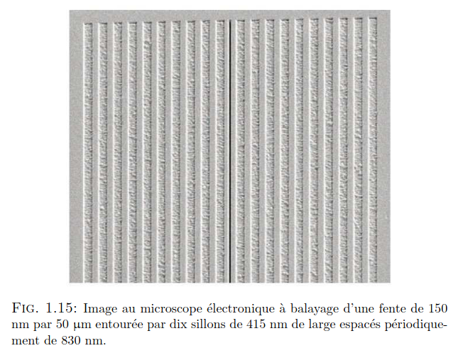
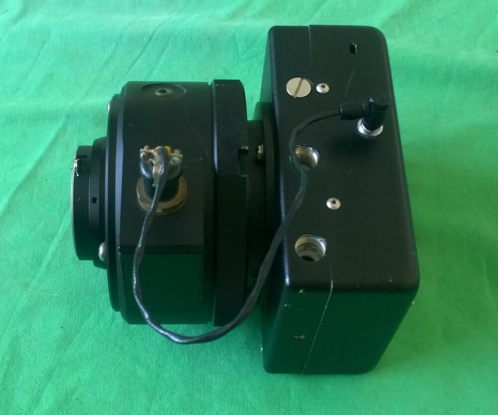
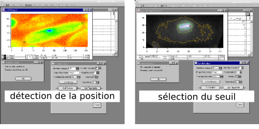
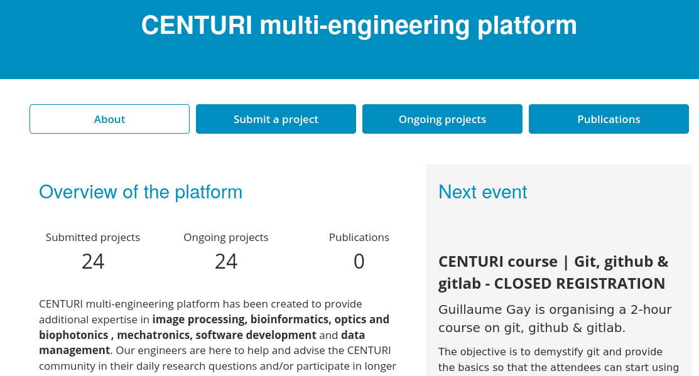
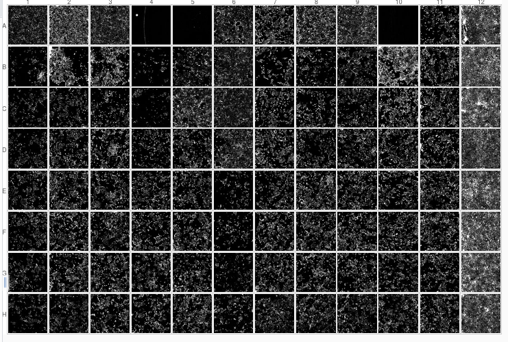
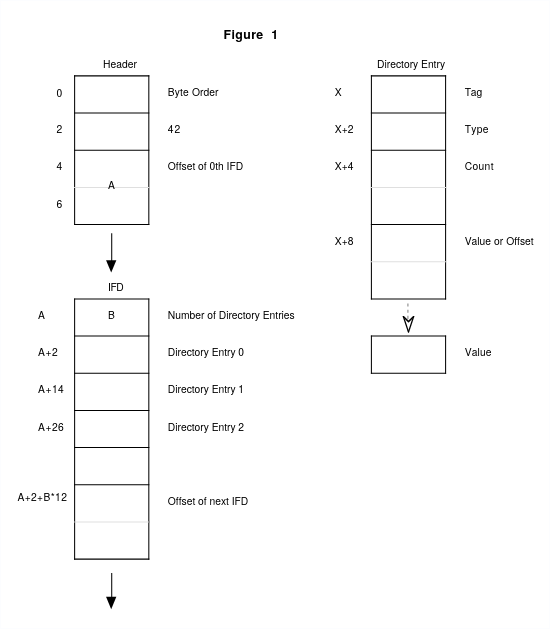
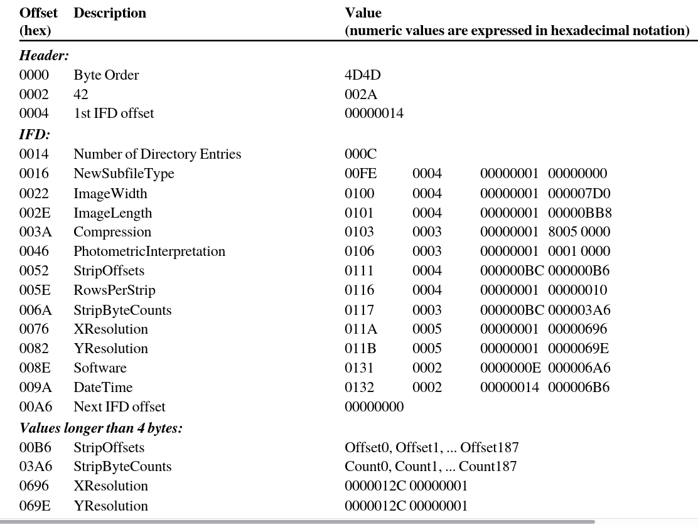

---
title: Bio-image databases
author: Guillaume Gay, CENTURI
date: 9 Octobre 2020
fontsize: 10pt
width: 800
height: 720
center: true
...


> We are here to talk about microscopy image databases. We are not going to talk a lot about the "database" part of that, because a lot has to be said about microscopy and images before that is more important.


## Why you are right to take this course

](images/excel_error.png)


_it is an accounting tool_

## Who am I?


### Training

- Licence "Sciences Physiques" (Strasbourg)
- Maîtrise "Sciences Physiques" (Toulouse)
- DEA (today's Master 2 recherche)
- PhD in 2006 fundamental optics and [_cold atoms_](https://en.wikipedia.org/wiki/Laser_cooling).

---------

I also studied how light goes through small apertures:



---------




### Postdocs

- From 2006 to 2012 I was a postdoc in biology & biophysics labs

I worked on microscope images of the fission yeast _Schizosaccharomyces pombe_


---------

- Widefield, 1 image stack (about 10 z) every 30 s for 30 min
- 10 cells to track per field of view
- 6 kinetochores per cell (so around 10 000 data points)




---------


- Then we did **laser ablation** & **Fluorescence recovery after photo-bleaching** experiments

> Very rich data : relaxation speeds, diffusion/binding coefficients...


---------


I used these to model  mechanical aspects of mitosis.


<video width="600" height="400" controls>
  <source src="images/JCB_201107124_V1.mp4" type="video/mp4">
</video>


### Freelance

In 2012 I started working as a freelance to do data analysis and modeling for biology research and biotech. Worked for various labs, for L'Oréal, for a small company on a method to measure eyesight with a VR headset...

------------


One of my main project is [tyssue](https://github.com/damcb/tyssue) which is a **library** used to model epithelium.

## CENTURI





## Course outline


1. What you learned on the first course

. . .

2. Some history of microscopy techniques

. . .


3. The digital image (data and metadata)

. . .


4. Databases (at last)


# What have you learned before?


## All the '-omics' DBs


- What was important in Bianca's course? (give me 3 take home messages)

. . .

For me:

* Primary / Secondary dbs

* Need for curation

* Lots of re-use (due to the homongeneity of input)


------------


> Images are much more messier

. . .

(_also bioinformaticians are computer scientists, microscopists are physicists_)

. . .

> Data management with bioimages is far less advanced.


# Some technique history


## Early Microscopes


[Antonie van Leewenhoek (1632–1723)](https://en.wikipedia.org/wiki/Antonie_van_Leeuwenhoek)

:::::::::::::: {.columns}
::: {.column width="50%"}
<p><a href="https://commons.wikimedia.org/wiki/File:Leeuwenhoek_Eschenholz.jpg#/media/File:Leeuwenhoek_Eschenholz.jpg"></a><a href="https://commons.wikimedia.org/w/index.php?curid=3652421">By Antoni van Leeuwenhoek, Public Domain</a></p>
:::
::: {.column width="50%"}
<p><a href="https://commons.wikimedia.org/wiki/File:Leeuwenhoek_Microscope.png#/media/File:Leeuwenhoek_Microscope.png"></a><a href="https://commons.wikimedia.org/w/index.php?curid=3657142">By Jeroen Rouwkema, CC BY-SA 3.0 </a></p>
:::
::::::::::::::


-----------------------


[Robert Hooke (1635-1703)](https://en.wikipedia.org/wiki/Robert_Hooke)

<p><a href="https://commons.wikimedia.org/wiki/File:HookeFlea01.jpg#/media/File:HookeFlea01.jpg"><a href="https://commons.wikimedia.org/w/index.php?curid=117354">National Library of Wales, Public Domain</a></p>


First detector is the **eye**, data is registered through simple drawings.

---------------------

[Santiago Ramón y Cajal (1852 - 1934)](https://en.wikipedia.org/wiki/Santiago_Ramón_y_Cajal)

<p><a href="https://commons.wikimedia.org/wiki/File:PurkinjeCell.jpg#/media/File:PurkinjeCell.jpg"></a><br>Public Domain, <a href="https://commons.wikimedia.org/w/index.php?curid=612581">Link</a></p>

> The eye & hand are still the best detector in the early XXth century.


### First photos


[Henry Fox Talbot (1800 - 1877)](https://en.wikipedia.org/wiki/Henry_Fox_Talbot)


See [this article](http://www.microscopy-uk.org.uk/mag/artmar10/history_photomicrography_ed3.pdf)


### First movies


[Jean Comandon in 1909](https://www.dailymotion.com/video/x6h3aas)


<iframe width="560" height="315" src="https://www.youtube.com/embed/09i1zdv3KVM" frameborder="0" allow="accelerometer; autoplay; clipboard-write; encrypted-media; gyroscope; picture-in-picture" allowfullscreen></iframe>


### Haemanthus katherinae (1956!)

[Mitosis in Haemanthus katharinae endosperm](http://www.cellimagelibrary.org/images/11952)

<video width="600" height="400" controls>
  <source src="images/11952_web.mp4" type="video/mp4">
</video>


## Technique evolution


### Fluorescence !

* dark field
* multiple colors
* **specificity** - we observe not only the organism but a precise _molecule_ within the organism.


### The confocal microscope

[Davidovits & Egger 1969](https://doi.org/10.1038/223831a0)

* The detector is a photomuliplier - first time the image from the microscope is a **signal**
* Only the light emitted at the focal point is recorded.


### Here comes the CCD

Some details on how it works [here](https://www.princetoninstruments.com/learn/camera-fundamentals/
)

* Photon counting!

* The image is a quantitative, digital, signal

. . .

> From now on, an image is represented by a matrix of pixels


## Modern microscopes


### The super resolution revolution

Do you know [Abbe](https://en.wikipedia.org/wiki/Ernst_Abbe) law?


. . .

$$d = \frac {\lambda}{2 n A}  $$


The minimum size of a motif - for exemple the distance between two spots, observable under a microscope is limited by the objective numerical aperture and the emission wavelength.

. . .

> We invented ways to beat that limit!

(can you cite super resolution methods?)

### An exemple: STORM:


Now instead of aquiring an image plane by plane (epifluorescence), or by scanning a pinhole (confocal), we detect individual proteins and point their positions. A single image is the combination of all thoses individual localisations.


### An other: Lattice light sheet

:::::::::::::: {.columns}
::: {.column width="50%"}
<iframe src="https://player.vimeo.com/video/109402221" width="640" height="537" frameborder="0" allow="autoplay; fullscreen" allowfullscreen></iframe>
<p><a href="https://vimeo.com/109402221">Movie 4 High Resolution</a> from <a href="https://vimeo.com/user33367262">HHMI NEWS</a> on <a href="https://vimeo.com">Vimeo</a>.</p>
:::
::: {.column width="50%"}
<iframe src="https://player.vimeo.com/video/109403013" width="640" height="640" frameborder="0" allow="autoplay; fullscreen" allowfullscreen></iframe>
<p><a href="https://vimeo.com/109403013">Movie 11 High Resolution</a> from <a href="https://vimeo.com/user33367262">HHMI NEWS</a> on <a href="https://vimeo.com">Vimeo</a>.</p>
:::
::::::::::::::


### Sreens and plates

> Multiple wells under a microscope on a moving stage

[An exemple of such system](https://www.perkinelmer.com/fr/product/opera-phenix-system-hh14000000)




## Conclusion

> Image aquisition methods have always been immediatly applied to microscopy

. . .


> The eye was surpassed only recently


. . .


> The image became _digital_ only 20 years ago!


# The digital image


> What is important to know?

. . .

> Data and metadata

. . .


> Can you cite image formats?


## TIFF is the norm


TIFF is for Tagged Interchange File Format

------------


A `TIFF` is a structured file with a header before the data:




-------------


> We have tags to store **metadata** !




---------------


What an 8 by 8 pixel file looks like:


```
00000000: 4949 2a00 0800 0000 0e00 0001 0400 0100  II*.............
00000010: 0000 0800 0000 0101 0400 0100 0000 0800  ................
00000020: 0000 0201 0300 0100 0000 0800 0000 0301  ................
00000030: 0300 0100 0000 0100 0000 0601 0300 0100  ................
00000040: 0000 0100 0000 0e01 0200 1200 0000 b600  ................
00000050: 0000 1101 0400 0100 0000 3001 0000 1501  ..........0.....
00000060: 0300 0100 0000 0100 0000 1601 0400 0100  ................
00000070: 0000 0800 0000 1701 0400 0100 0000 4000  ..............@.
00000080: 0000 1a01 0500 0100 0000 0801 0000 1b01  ................
00000090: 0500 0100 0000 1001 0000 2801 0300 0100  ..........(.....
000000a0: 0000 0100 0000 3101 0200 0c00 0000 1801  ......1.........
000000b0: 0000 0000 0000 7b22 7368 6170 6522 3a20  ......{"shape":
000000c0: 5b38 2c20 385d 7d00 0000 0000 0000 0000  [8, 8]}.........
000000d0: 0000 0000 0000 0000 0000 0000 0000 0000  ................
000000e0: 0000 0000 0000 0000 0000 0000 0000 0000  ................
000000f0: 0000 0000 0000 0000 0000 0000 0000 0000  ................
00000100: 0000 0000 0000 0000 0100 0000 0100 0000  ................
00000110: 0100 0000 0100 0000 7469 6666 6669 6c65  ........tifffile
00000120: 2e70 7900 0000 0000 0000 0000 0000 0000  .py.............
00000130: 0101 0101 0101 0101 0101 0101 0101 0101  ................
00000140: 0101 0101 0101 0101 0101 0101 0101 0101  ................
00000150: 0101 0101 0101 0101 0101 0101 0101 0101  ................
00000160: 0101 0101 0101 0101 0101 0101 0101 0101  ................
```


## A sad story

* In the 90's - 2000's, MetaMorph software dominates the industry, has its own 'format'

. . .

* Eventually, constructors build their own software, try to impose it, how?

. . .


> $\Rightarrow$ Lots of incompatible & proprietary formats


## OME to the rescue


> «It is possible to interpret images only if we know the context in which they were acquired»


## The OME-TIFF Format

We can put "things" in the `TIFF` header - so why not all the metadata we can think off?

. . .

> This became a [standard](https://docs.openmicroscopy.org/ome-model/6.0.0/ome-tiff/index.html#support)


## The whole schema

Is available [here](https://www.openmicroscopy.org/Schemas/OME/2016-06/ome.xsd)

. . .

Look for the important points you thought of.

. . .

What do you think of XML?


## In a file


```xml
<Image ID="Image:0" Name="Excy2_4.6.+12.lif [Excy2 4.6 - Phall CD24 Org 2]">
  <AcquisitionDate>2016-05-20T13:08:29
  </AcquisitionDate>
<ImagingEnvironment/>
<Pixels BigEndian="true"
        DimensionOrder="XYCZT"
        ID="Pixels:0"
        Interleaved="false"
        PhysicalSizeX="0.4814710371819961"
        PhysicalSizeXUnit="µm"
        PhysicalSizeY="0.4814710371819961"
        PhysicalSizeYUnit="µm"
        SignificantBits="8"
        SizeC="4"
        SizeT="1"
        SizeX="512"
        SizeY="512"
...
```

See more details [here](https://docs.openmicroscopy.org/ome-model/6.0.0/ome-tiff/specification.html)


### Limits to OME-XML

. . .

What did you say a microscope image was?

. . .


### The future: how to define flexible, "just general enough" file formats.


Let's look at [ZARR](https://forum.image.sc/t/next-generation-file-formats-for-bioimaging/31361)


# Finally Databases!


## One DB system to rule them all: OMERO


* Postgresql based
* Lots of [features](https://www.openmicroscopy.org/omero/scientists/)


[We happen to have one here](https://centur-engineering.univ-amu.fr)


## The Contender Cytomine (but still using BioFormats!)


Cytomine is oriented towards _collaboration_ after the image is produced.


---------------


# Public microscopy image databases

## A word on FAIR

* We need to be able to **reuse** data
* We must be able to do this automatically

Published [here](https://www.nature.com/articles/sdata201618)


> Findability

> Accessibility

> Interoperability

> Reusability


## A non exhaustive list:

* [HDBR Atlas](http://hdbratlas.org/)
* [ASCB CELL Image Library](http://www.cellimagelibrary.org/)
* [Harvard Medical School LINCS Project](http://lincs.hms.harvard.edu/)

[For example](https://lincs.hms.harvard.edu/db/datasets/20002/results#)

------------

* [Stowers Institute Original Data Repository](ttp://www.stowers.org/research/publications/odr)
* [JCB DataViewer](ttp://jcb-dataviewer.rupress.org/)


## The Allen Institute

### Brain Atlases

[See here](https://portal.brain-map.org/)


###  The Allen Cell explorer

* Tries to know all the possible states of stem cells


* Created an extensive [catalog](https://www.allencell.org/cell-catalog.html) of cell structures

## 4D Nucleome


A platform to search, visualize, and download nucleomics data.

Icludes [microscopy data](https://data.4dnucleome.org/microscopy-data-overview)

## European initiatives

Under the [BioImage Archive](https://www.ebi.ac.uk/bioimage-archive/)


* [EMBL EMPIAR](https://www.ebi.ac.uk/pdbe/emdb/empiar/])
* [IDR](https://idr.openmicroscopy.org)


## Conclusion

-----------

Already a lot of ressources **but**

- Little actual re-use for now

. . .

- Not used every where (biologists are still reluctant to share)

. . .


------------


What I haven't talked about

- Automated image analysis
- [Kaggle](https://www.kaggle.com/competitions) & gameification
- Segmentation [challenges](https://www.meduniwien.ac.at/hp/fileadmin/ipa/NEWS/Research_News/Kumar_et_al_2019.pdf)


------------


Next week:

* Hands on with IDR and our local OMERO
* Some automated analysis
